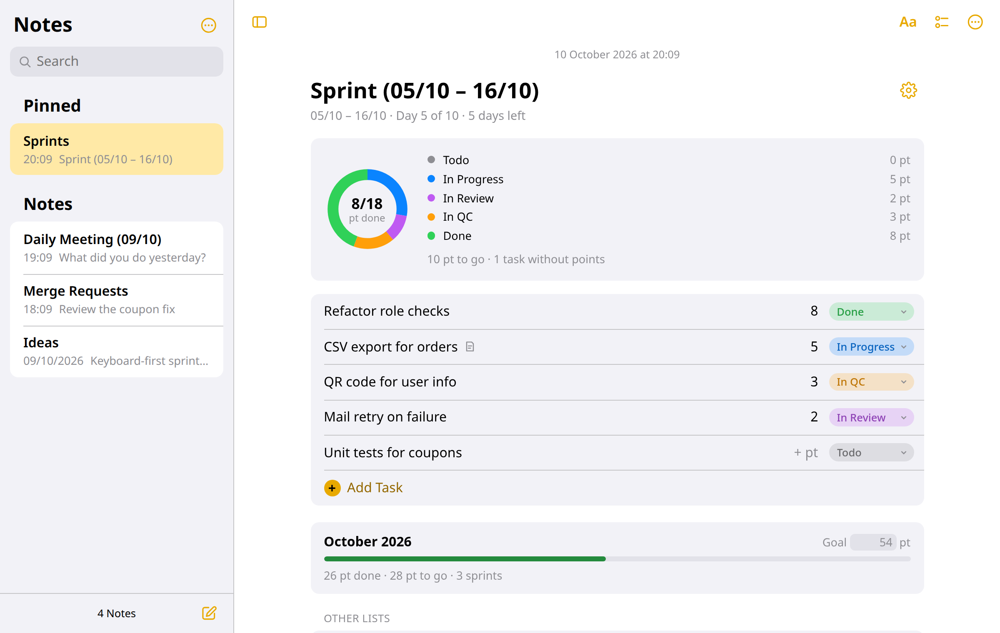
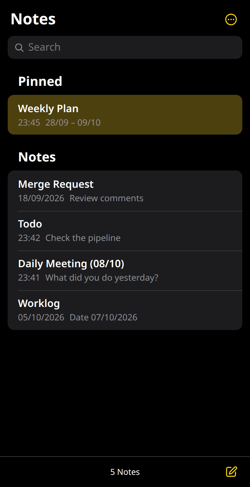
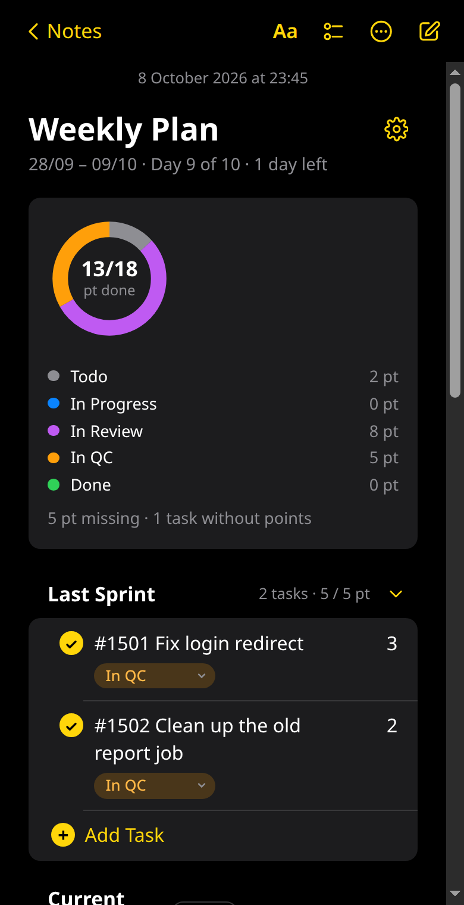

# Notelet

[](https://github.com/ttncode/notelet/releases/latest)
[](LICENSE)


Lightweight notes for Chrome in the style of the Notes app on iPhone, with a points chart for sprint notes. Notes stay in your browser — no account, no sync, nothing sent anywhere.

Notelet is an independent project and is not affiliated with or endorsed by Apple.

<picture>
  <source media="(prefers-color-scheme: dark)" srcset="assets/screenshots/notelet-dark.png">
  
</picture>

In a narrow window Notelet switches to the iPhone layout: the list first, then the note with a back button.

<p>
  
  
</p>

## Install

1. Download `notelet-<version>.zip` from [Releases](../../releases) and unzip it into a folder you will keep.
2. Open `chrome://extensions` and turn on **Developer mode**.
3. Click **Load unpacked** and choose the unzipped folder (the one containing `manifest.json`).
4. Pin Notelet to the toolbar. To open it from the keyboard, set a shortcut at `chrome://extensions/shortcuts` (suggested: `Alt+.`).

Works the same in Edge (`edge://extensions`) and Brave (`brave://extensions`).

## Update

Extensions loaded this way never update themselves.

1. Export a backup (sidebar → **Export**).
2. Replace the folder's contents with the new release.
3. In `chrome://extensions`, click the reload icon on Notelet.

Your notes stay: Notelet's extension ID is fixed, so Chrome keeps the same storage.

## Back up your notes

Notes live only in this browser profile. **Removing the extension deletes all of them**, and Chrome offers no way to keep them. Export regularly; **Import** merges a backup back in (a note with the same ID is replaced).

## Sprint notes

Click the compose button and choose **New Sprint** (or press `Alt+S`). A sprint note starts the day after your last sprint ends, lasts two weeks and keeps the last target.

- The ring at the top shows completed points against the target, the dates and the sprint day.
- Each checklist line is a ticket. Click its **points** chip to type a number and its **status** chip to move it to the next status.
- Tick a ticket when its development is done; only ticked tickets count as completed. Status is for tracking only.
- The ⚙ button changes this sprint's dates and target, and the status names, colours and order shared by all sprints.

Notes from earlier versions that used a `Target: 18` line are converted to sprint notes automatically.

## Keyboard shortcuts

Click **?** in the sidebar for the full list. Text styles follow Notes for Mac with Ctrl in place of Cmd; where Chrome reserves a shortcut (Ctrl+N, Ctrl+Shift+T) Notelet uses Alt instead.

## Development

```bash
npm install
npm test                  # unit tests for the pure modules
node tools/make-icons.mjs # regenerate icons
tools/package.sh          # build dist/notelet-<version>.zip
```

Load the `extension/` folder unpacked to try changes, then click reload in `chrome://extensions`.

Working in WSL? Chrome's folder picker cannot open `\\wsl.localhost` paths, so copy the folder to the Windows side and load the copy:

```bash
rsync -a --delete extension/ /mnt/c/Users/<you>/Notelet-dev/
```

## License

[MIT](LICENSE)
